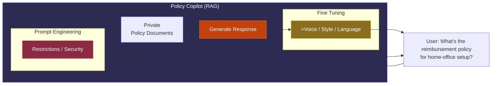

# RAG & MCP Fundamentals

Hands-on lab repo for learning RAG (Retrieval-Augmented Generation)
fundamentals. Build and compare keyword search (TF-IDF, BM25) against
semantic search (embedding) and a vector DB (Chroma), on a small
policy-doc dataset. Each lab is self-contained: the algorithm(s) it
teaches live right next to the script that runs them.

## What's inside

- **`labs/lab1_keyword_search/`** — Lab 1: keyword search.
  - `tfidf_method.py` — `TfidfSearch`, `get_scores(query)` interface.
  - `bm25_method.py` — `BM25Search`, same interface.
  - `run.py` — runs both against `data/policies.json`, canned test
    queries, side-by-side score comparison.
- **`labs/lab2_semantic_search/`** — Lab 2: semantic (embedding) search.
  - `embedding_method.py` — `SemanticSearch`, same `get_scores(query)`
    interface as the keyword methods.
  - `run.py` — runs TF-IDF vs BM25 vs Semantic against labeled test
    cases, reports accuracy % per method.
  - `scratch/embedding_ai.py` — side experiment: embeddings via the
    OpenAI API instead of a local model. Needs `OPENAI_API_KEY` in
    `.env`. Not wired into `run.py` — costs API credits per run.
  - `scratch/vector_similarity.py` — scratch cosine-similarity script,
    same math as `SemanticSearch` demonstrated manually on 3 sentences.
- **`labs/lab3_chunking_vector_db/`** — Lab 3/4: chunking + vector DB.
  - `chunking.py` — `chunk_document(text, chunk_size, overlap)`.
    Enforces size guideline (200-500 char), overlap guideline (50-100
    char), and the boundary rule (cut on sentence end, never
    mid-word, fallback to nearest whitespace).
  - `database.py` — vector store functions: `get_fresh_collection()`,
    `add_chunks()`, `query_collection()`. Thin wrapper around
    `chromadb`.
  - `run.py` — chunks `data/policies_large.txt`, loads into Chroma,
    runs a test query, prints raw distance scores per result.
- **`shared/utils.py`** — helpers used across labs: `load_policies`,
  `print_results`, `run_test_queries`, `evaluate_accuracy`.
- **`data/policies.json`** — 5 sample HR policy docs (WFH reimbursement,
  learning budget, health/wellness, home-office setup, flexible hours).
  Test corpus for keyword/semantic search.
- **`data/policies_large.txt`** — expanded plain-text version of the same
  policies, long enough to actually exercise chunking (boundary rule,
  overlap) — the JSON version is too short to produce more than one
  chunk each.
- **`notes/chunking`** — deep-dive notes on chunking strategies
  (fixed-size, sentence, paragraph, semantic, agentic) and advanced
  tactics (parent-child retrieval, metadata enrichment, hybrid +
  rerank).
- **`notes/comparison_semantic_n_keyword`** — keyword vs semantic
  tradeoff writeup with real score output from this repo.
- **`notes/embedding_models`** — math notes: vectors, dot product,
  cosine similarity, worked example.
- **`config.py`** — loads `OPENAI_API_KEY` from `.env` via `dotenv`.
  Stays at repo root since `.env` lives at root too. Only used by
  `labs/lab2_semantic_search/scratch/embedding_ai.py`.

## Project structure

```
.
├── labs/
│   ├── lab1_keyword_search/
│   │   ├── tfidf_method.py
│   │   ├── bm25_method.py
│   │   └── run.py
│   ├── lab2_semantic_search/
│   │   ├── embedding_method.py
│   │   ├── run.py
│   │   └── scratch/
│   │       ├── embedding_ai.py
│   │       └── vector_similarity.py
│   └── lab3_chunking_vector_db/
│       ├── chunking.py
│       ├── database.py
│       └── run.py
├── shared/
│   └── utils.py
├── data/
│   ├── policies.json
│   └── policies_large.txt
├── notes/
│   ├── chunking
│   ├── comparison_semantic_n_keyword
│   └── embedding_models
├── config.py
├── requirements.txt
└── README.md
```

## Setup

```powershell
py -m venv venv
venv\Scripts\activate
pip install -r requirements.txt
```

## Run

Run each lab as a module from the repo root:

```powershell
py -m labs.lab1_keyword_search.run       # Lab 1: TF-IDF vs BM25
py -m labs.lab2_semantic_search.run      # Lab 2: TF-IDF vs BM25 vs Semantic, accuracy %
py -m labs.lab3_chunking_vector_db.run   # Lab 3/4: chunk + Chroma vector DB
```

Optional side experiment (needs `OPENAI_API_KEY` in `.env`, costs
API credits per run):
```powershell
py -m labs.lab2_semantic_search.scratch.embedding_ai
```

## Notes / findings

- TF-IDF and BM25 mostly agree, but disagree on ambiguous queries where
  multiple docs share vocabulary (e.g. "reimbursed" appears in 4 of 5
  policies).
- Neither keyword method handles zero-keyword-overlap queries well —
  `"can I get money for gym"` breaks both since it shares zero words with
  "Health & Wellness". Semantic search closes this gap by matching on
  meaning instead.
- Chunking on the short `policies.json` text barely produces more than
  one chunk per doc — `policies_large.txt` exists specifically to give
  `chunk_document()` enough room to exercise boundary/overlap logic.
- Chroma's default embedder and `SemanticSearch`'s `all-MiniLM-L6-v2`
  are different models — their scores aren't directly comparable even
  on the same query.

## Roadmap

- [x] Lab 1: Keyword search (TF-IDF, BM25)
- [x] Lab 2: Semantic search with embeddings
- [x] Lab 3: Vector database (Chroma)
- [x] Lab 4: Document chunking
- [ ] Lab 5: Full RAG pipeline (wire retrieved chunks into an actual LLM
      call to generate a grounded response)
- [ ] Frontend: visualize the process flow (chunk → store → retrieve)
      end to end
- [ ] Labs 6–8: MCP server/client

---

# RAG Architecture Reference

Recreated from a PolicyCopilot architecture diagram — shows how a single
user query can be handled by three different approaches: Prompt
Engineering, RAG, and Fine-Tuning, working together.



## What each block does

- **Query** — user question enters system. Two edges connect it to
  **Prompt Engineering**: `Query --> Ps` sends it in, `Ps --> Query`
  means prompt engineering also gatekeeps/sanitizes right at entry.
- **RAG (Policy Copilot)** — outer box, whole pipeline lives inside it,
  four stages in sequence:
  1. **Prompt Engineering** (`Ps` subgraph, holds `PE` node) — restriction,
     guardrail, security rule enforced first.
  2. **Private Policy Documents** (`PPD`) — the retrieval step. In this
     repo this maps to `data/policies.json` / `policies_large.txt`,
     chunked by `labs/lab3_chunking_vector_db/chunking.py`, retrieved
     through `labs/lab1_keyword_search/` and `labs/lab2_semantic_search/`.
  3. **Generate Response** (`Gen`) — model produces answer grounded on
     whatever `PPD` handed it. Not built yet in this repo (Lab 5).
  4. **Fine Tuning** (`Ft` subgraph, holds `FT` node) — final
     voice/style/language pass.
- **`FT --> Query`** — final response loops back out to answer the
  original query.

## How this maps to the repo

- `PPD` (Private Policy Documents) → `data/policies.json`,
  `data/policies_large.txt`, chunked via
  `labs/lab3_chunking_vector_db/chunking.py`.
- Retrieval method → `labs/lab1_keyword_search/`,
  `labs/lab2_semantic_search/`, all sharing `get_scores(query)`.
- `labs/lab3_chunking_vector_db/run.py` — chunk, store, retrieve, all
  in one runnable script.
- `Generate Response` — not built yet, Lab 5 territory.
- `Prompt Engineering` / `Fine Tuning` — not covered by this repo's labs
  yet, sit outside current scope.